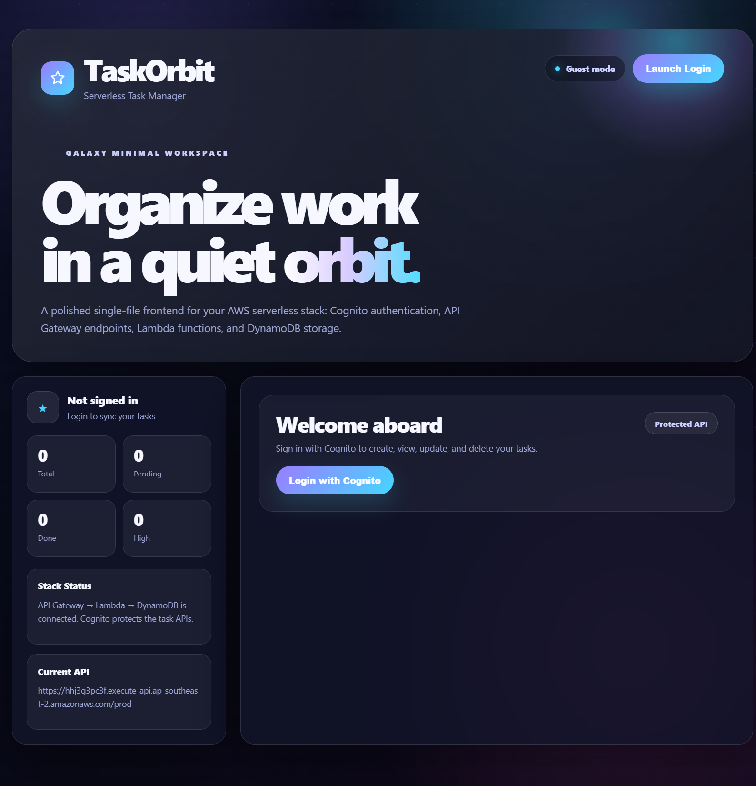
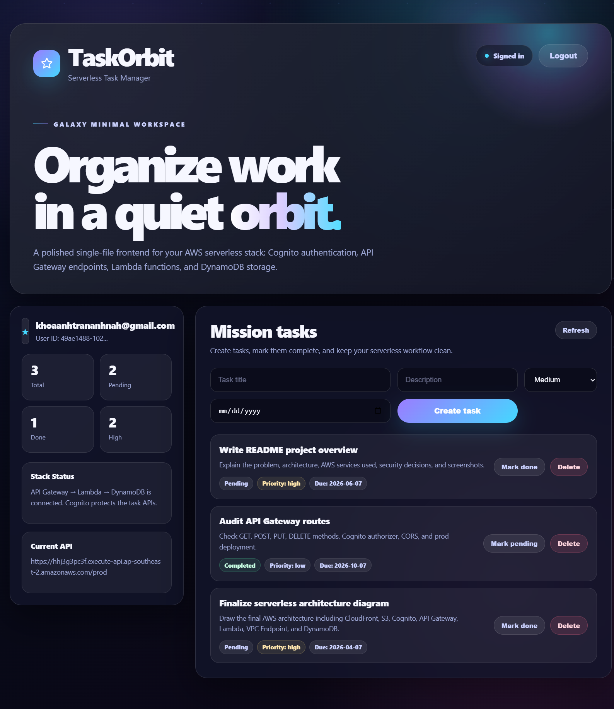
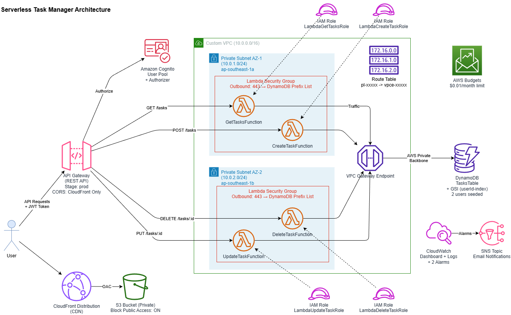
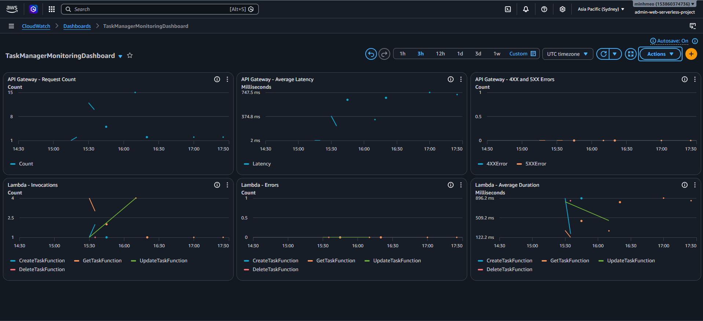
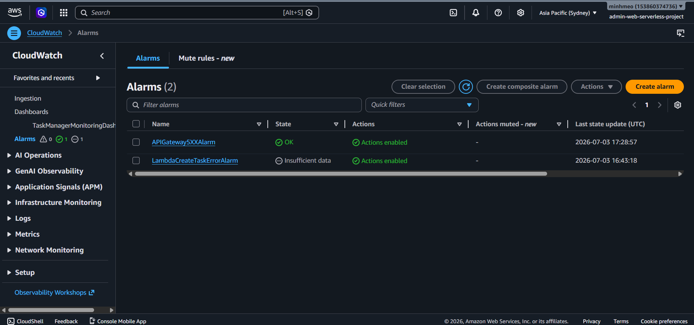
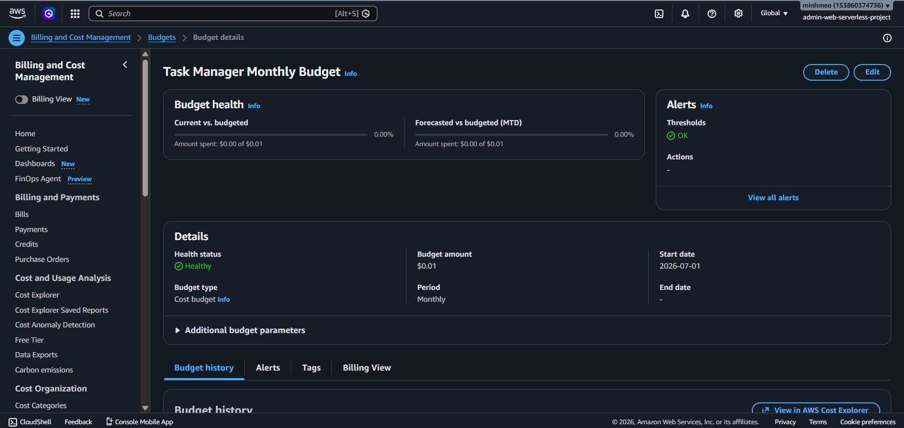
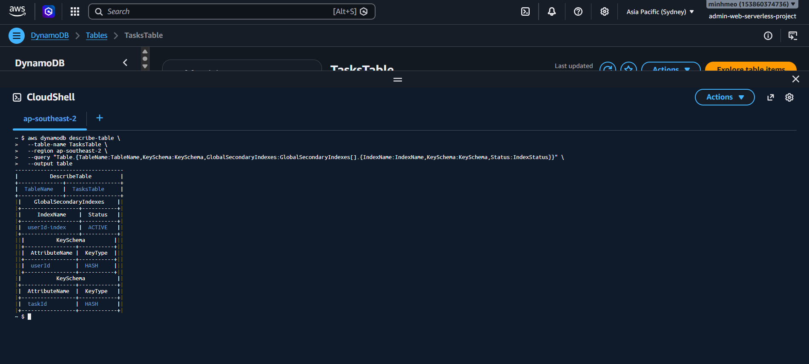

# TaskOrbit - Serverless Task Manager

TaskOrbit is a galaxy-themed serverless task management web app built on AWS. Authenticated users can sign in, create tasks, view only their own tasks, update task status, and delete tasks.

This project was built manually using the AWS Console for a cloud computing and serverless architecture assignment.

## Features

- User authentication with Amazon Cognito Hosted UI
- Create, read, update, and delete task workflows
- Per-user task isolation using Cognito JWT claims
- Serverless REST API backed by AWS Lambda
- DynamoDB task storage with a user-based Global Secondary Index
- Private frontend hosting through S3 and CloudFront
- Private Lambda networking with DynamoDB Gateway Endpoint access
- CloudWatch dashboard, alarms, SNS notifications, and AWS Budget controls

## Tech Stack

| Layer | Technology |
| --- | --- |
| Frontend | HTML, CSS, JavaScript |
| Hosting/CDN | Amazon S3 private bucket, Amazon CloudFront |
| Authentication | Amazon Cognito User Pool, Cognito Hosted UI |
| API | Amazon API Gateway REST API |
| Compute | AWS Lambda, Node.js 24.x |
| Database | Amazon DynamoDB |
| Networking | Custom VPC, private subnets, security group, DynamoDB Gateway Endpoint |
| Monitoring | Amazon CloudWatch Dashboard, CloudWatch Alarms, SNS |
| Cost Control | AWS Budget, Lambda Reserved Concurrency, no NAT Gateway |

## Architecture Overview

TaskOrbit uses a fully serverless AWS architecture. Static frontend assets are served from a private S3 bucket through CloudFront using Origin Access Control. Users authenticate with Cognito Hosted UI, and API Gateway protects task routes with a Cognito User Pool Authorizer.

Lambda functions run inside private VPC subnets and access DynamoDB through a DynamoDB Gateway Endpoint. This avoids public internet routing and removes the need for a NAT Gateway.

The DynamoDB table is named `TasksTable`, with `taskId` as the partition key. A Global Secondary Index named `userId-index` is used to query tasks by the authenticated Cognito user.

```text
User Browser
-> CloudFront
-> Private S3 Bucket protected by Origin Access Control
-> Cognito Hosted UI for authentication
-> API Gateway REST API
-> Cognito User Pool Authorizer
-> Lambda functions inside private VPC subnets
-> DynamoDB Gateway Endpoint
-> DynamoDB TasksTable
```

## Repository Structure

```text
taskorbit-serverless/
|-- frontend/
|   |-- index.html
|   |-- styles.css
|   `-- app.js
|-- backend/
|   `-- lambdas/
|       |-- create-task/
|       |   `-- index.mjs
|       |-- get-tasks/
|       |   `-- index.mjs
|       |-- update-task/
|       |   `-- index.mjs
|       `-- delete-task/
|           `-- index.mjs
|-- docs/
|   |-- architecture.md
|   |-- architecture.drawio
|   |-- architecture-diagram.png
|   `-- monitoring.md
|-- screenshots/
|-- README.md
`-- .gitignore
```

## API Endpoints

| Method | Endpoint | Description |
| --- | --- | --- |
| GET | `/tasks` | Get all tasks for the authenticated user |
| POST | `/tasks` | Create a task |
| PUT | `/tasks/{id}` | Update task status |
| DELETE | `/tasks/{id}` | Delete a task |

## Security Design

- S3 blocks all public access.
- CloudFront uses Origin Access Control to access the private S3 bucket.
- API Gateway routes are protected by a Cognito User Pool Authorizer.
- Lambda functions extract the authenticated Cognito user ID from JWT claims.
- Tasks are scoped by `userId`, so users can only access their own task records.
- Lambda functions run in private VPC subnets.
- DynamoDB traffic flows through a DynamoDB Gateway Endpoint instead of the public internet or a NAT Gateway.
- IAM roles are scoped to the DynamoDB resources required by each Lambda function.
- No AWS account IDs, access keys, secret keys, JWT tokens, or personal email addresses should be committed to the repository.

## Monitoring and Cost Control

The CloudWatch dashboard tracks API Gateway request count, API Gateway latency, API Gateway 4XX/5XX errors, Lambda invocations, Lambda errors, and Lambda duration.

Configured alarms include:

- `APIGateway5XXAlarm`
- `LambdaCreateTaskErrorAlarm`

SNS email notifications are configured for alarm delivery. AWS Budget is configured for cost control, and Lambda Reserved Concurrency is set to reduce unexpected scaling during demo and testing.

The architecture intentionally avoids a NAT Gateway to reduce recurring network costs.

## Screenshots

### Application Home



### Task Management View



### Architecture Diagram



### CloudWatch Dashboard



### CloudWatch Alarms



### AWS Budget



### DynamoDB Table



## Deployment Notes

This project was deployed manually through the AWS Console. The repository does not currently include Terraform, AWS CDK, AWS SAM, CloudFormation, Docker, or CI/CD configuration.

High-level deployment steps:

1. Upload frontend files to a private S3 bucket.
2. Configure CloudFront with Origin Access Control for private S3 access.
3. Create a Cognito User Pool and Hosted UI app client.
4. Create a DynamoDB table named `TasksTable` with a `userId-index` GSI.
5. Deploy the Lambda functions using Node.js 24.x.
6. Place Lambda functions in private VPC subnets with security group egress to DynamoDB.
7. Create a DynamoDB Gateway Endpoint and associate it with private route tables.
8. Configure API Gateway REST routes and protect them with the Cognito User Pool Authorizer.
9. Configure CloudWatch dashboard, alarms, SNS notifications, AWS Budget, and Lambda Reserved Concurrency.

For public portfolio sharing, production API and Cognito URLs in the frontend can be replaced with placeholders to avoid exposing live endpoints or incurring unexpected usage.

## Access Link
You can try the deployed TaskOrbit application here:
[https://d1zwyx8c9laxno.cloudfront.net](https://d1zwyx8c9laxno.cloudfront.net)